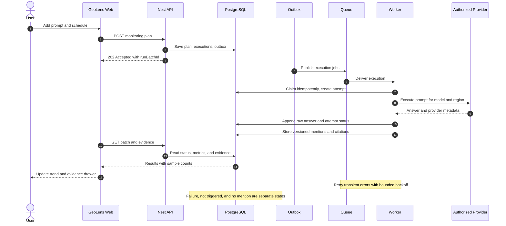
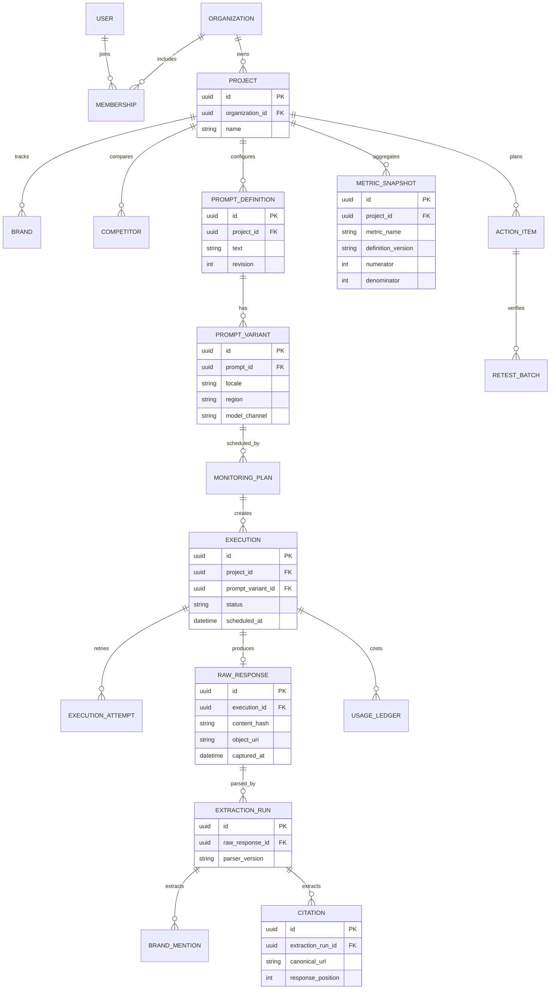
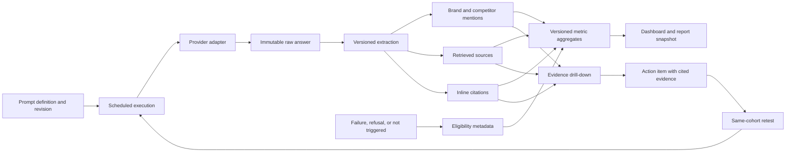

# GEO SaaS 参考架构图

这些 Mermaid 图均表示 GeoLens 的独立参考设计，不是对任何竞品私有后端的还原。对应源文件保存在同目录的 .mmd 文件中。

## 监测任务时序

```mermaid
sequenceDiagram
    autonumber
    actor User
    participant Web as GeoLens Web
    participant API as Nest API
    participant DB as PostgreSQL
    participant Outbox
    participant Queue
    participant Worker
    participant Provider as Authorized Provider

    User->>Web: Add prompt and schedule
    Web->>API: POST monitoring plan
    API->>DB: Save plan, executions, outbox
    API-->>Web: 202 Accepted with runBatchId
    Outbox->>Queue: Publish execution jobs
    Queue->>Worker: Deliver execution
    Worker->>DB: Claim idempotently, create attempt
    Worker->>Provider: Execute prompt for model and region
    Provider-->>Worker: Answer and provider metadata
    Worker->>DB: Append raw answer and attempt status
    Worker->>DB: Store versioned mentions and citations
    Web->>API: GET batch and evidence
    API->>DB: Read status, metrics, and evidence
    DB-->>Web: Results with sample counts
    Web-->>User: Update trend and evidence drawer

    Note over Worker,Queue: Retry transient errors with bounded backoff
    Note over DB: Failure, not triggered, and no mention are separate states
```
## 参考数据模型

```mermaid
erDiagram
    ORGANIZATION ||--o{ MEMBERSHIP : includes
    USER ||--o{ MEMBERSHIP : joins
    ORGANIZATION ||--o{ PROJECT : owns
    PROJECT ||--o{ BRAND : tracks
    PROJECT ||--o{ COMPETITOR : compares
    PROJECT ||--o{ PROMPT_DEFINITION : configures
    PROMPT_DEFINITION ||--o{ PROMPT_VARIANT : has
    PROMPT_VARIANT ||--o{ MONITORING_PLAN : scheduled_by
    MONITORING_PLAN ||--o{ EXECUTION : creates
    EXECUTION ||--o{ EXECUTION_ATTEMPT : retries
    EXECUTION ||--o| RAW_RESPONSE : produces
    RAW_RESPONSE ||--o{ EXTRACTION_RUN : parsed_by
    EXTRACTION_RUN ||--o{ BRAND_MENTION : extracts
    EXTRACTION_RUN ||--o{ CITATION : extracts
    PROJECT ||--o{ METRIC_SNAPSHOT : aggregates
    PROJECT ||--o{ ACTION_ITEM : plans
    ACTION_ITEM ||--o{ RETEST_BATCH : verifies
    EXECUTION ||--o{ USAGE_LEDGER : costs

    PROJECT {
        uuid id PK
        uuid organization_id FK
        string name
    }
    PROMPT_DEFINITION {
        uuid id PK
        uuid project_id FK
        string text
        int revision
    }
    PROMPT_VARIANT {
        uuid id PK
        uuid prompt_id FK
        string locale
        string region
        string model_channel
    }
    EXECUTION {
        uuid id PK
        uuid project_id FK
        uuid prompt_variant_id FK
        string status
        datetime scheduled_at
    }
    RAW_RESPONSE {
        uuid id PK
        uuid execution_id FK
        string content_hash
        string object_uri
        datetime captured_at
    }
    EXTRACTION_RUN {
        uuid id PK
        uuid raw_response_id FK
        string parser_version
    }
    CITATION {
        uuid id PK
        uuid extraction_run_id FK
        string canonical_url
        int response_position
    }
    METRIC_SNAPSHOT {
        uuid id PK
        uuid project_id FK
        string metric_name
        string definition_version
        int numerator
        int denominator
    }
```

## Evidence 数据流与 Retest

```mermaid
flowchart LR
    A[Prompt definition and revision] --> B[Scheduled execution]
    B --> C[Provider adapter]
    C --> D[Immutable raw answer]
    D --> E[Versioned extraction]
    E --> F[Brand and competitor mentions]
    E --> G[Retrieved sources]
    E --> H[Inline citations]
    F --> I[Versioned metric aggregates]
    G --> I
    H --> I
    I --> J[Dashboard and report snapshot]
    F --> K[Evidence drill-down]
    G --> K
    H --> K
    K --> L[Action item with cited evidence]
    L --> M[Same-cohort retest]
    M --> B
    N[Failure, refusal, or not triggered] --> O[Eligibility metadata]
    O --> I
```
